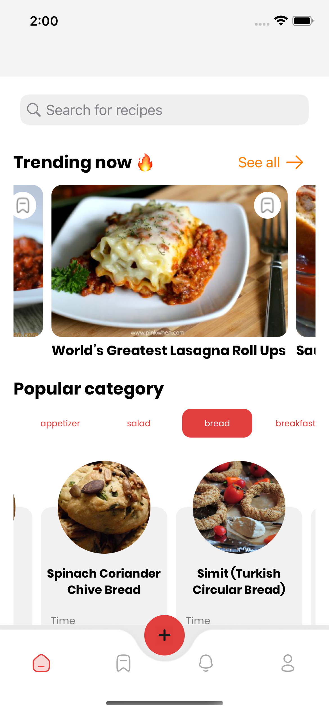
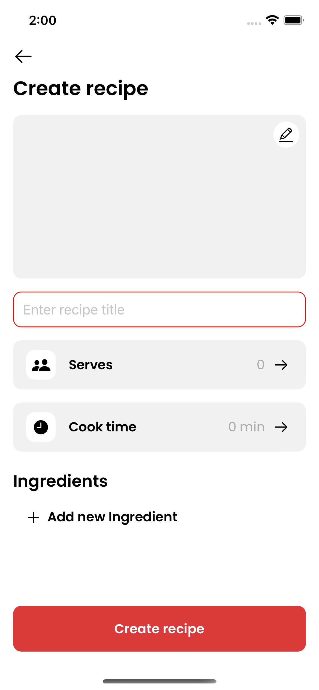
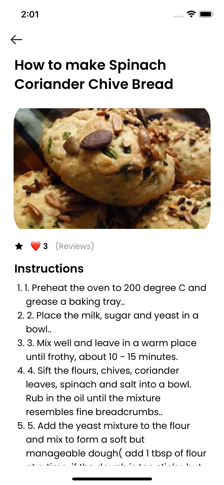
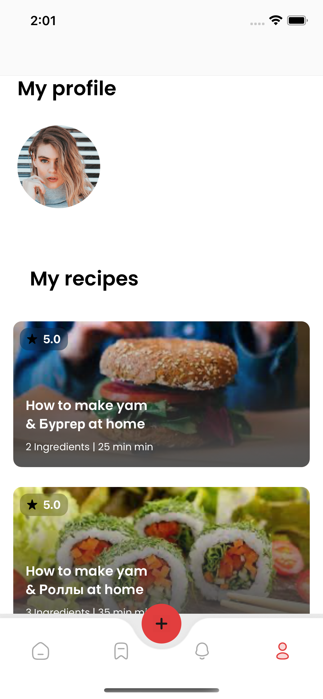

# BestRecipes

Название проекта:
"BestRecipes"
Приложение разработано в рамках второго челленджа на 8-го потока SfifTMarathon (https://t.me/swiftmarathon).

Стек технологий:
В данном приложении подгружается информация по рецептам с помощью API с сайта http://spoonacular.com

  1) Архитектора: 
MVP + Router 
Проект использует архитектуру MPV (Model-View-Presenter) в сочетании с паттерном Router для эффективной организации компонентов приложения.

  2) Программная верстка кода:
Весь интерфейс и пользовательский опыт приложения реализован с использованием программной верстки кода, что обеспечивает более гибкое управление интерфейсом и его разработкой.

  4) Инъекция зависимости (Dependency Injection)
Проект использует инъекцию зависимостей для управления зависимостями компонентов и улучшения тестируемости кода.

  5) Работа с данными
Для хранения данных и обеспечения возможности использования рецептов даже без подключения к Интернету, проект взаимодействует с базой данных Realm. Это обеспечивает надежное сохранение данных и их доступность в офлайн-режиме.

  6) Поиск с SearchController
Для удобного поиска данных в приложении используется SearchController, который позволяет пользователям быстро находить необходимую информацию.

Буду рад комментарием по коду,)

В создании приложения участвовали:
1. KellerDmitriy (https://github.com/KellerDmitriy)
2. Sbat2000 (https://github.com/Sbat2000)
3. alexrybachev (https://github.com/alexrybachev)
4. Мявк (https://github.com/Myawk0)
5. Privetyanikita (https://github.com/Privetyanikita)
6. AryaDarisova (https://github.com/AryaDarisova)

**Screenshots :**

